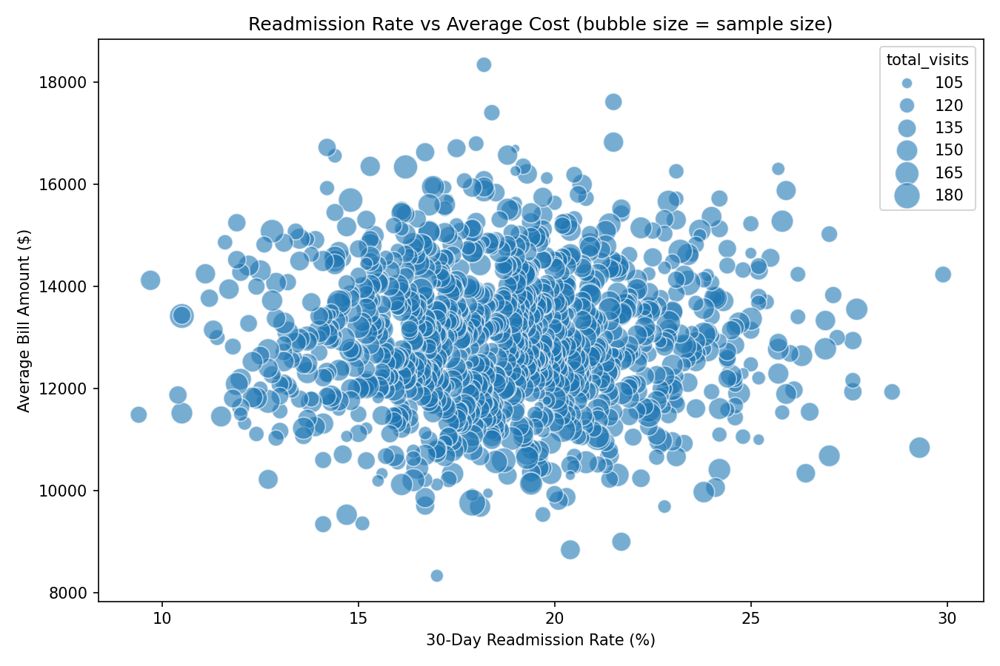
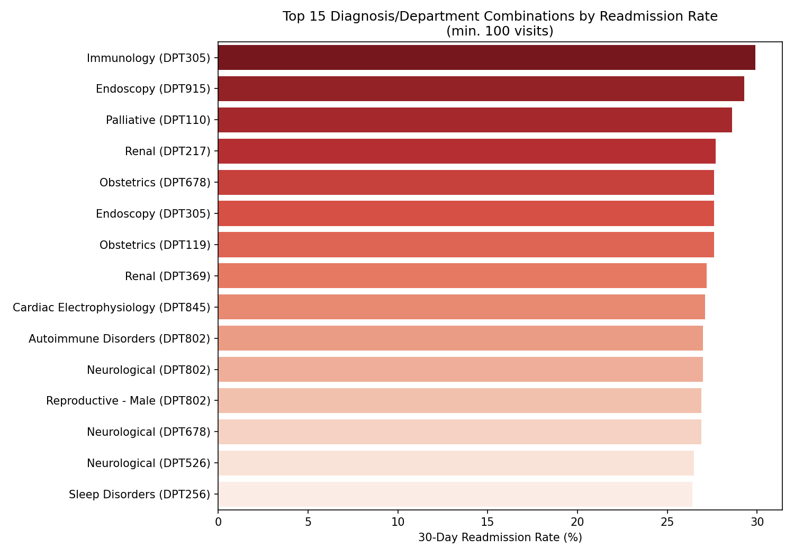
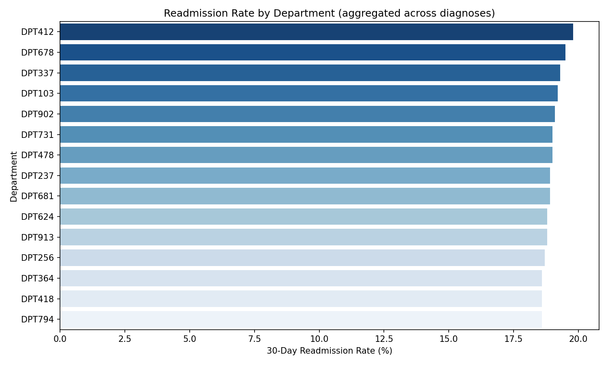

# 30-Day Readmission Patterns: Which Diagnoses and Departments Drive Repeat Admissions

A SQL + Python analysis of a synthetic hospital management dataset, built to practice real-world data validation as much as the analysis itself — nearly half the "readmission" signal in this dataset turned out to be a data quality artifact, and finding that mattered more than the headline chart.

## Key findings

- **No clear relationship between readmission rate and average cost** for a diagnosis/department combination — high-readmission groups aren't consistently more or less expensive than low-readmission ones.
- **The worst-performing combinations are specific diagnosis + department pairs, not whole departments.** The highest single combination hits a 30% readmission rate, but once aggregated to department level, the worst department only reaches ~20% — meaning targeted intervention on specific diagnosis/department pairs would be far more effective than a department-wide fix.
- **45% of consecutive visit pairs in the raw data had a physically impossible timeline** (the next admission starting before the previous discharge). This was caught during validation, not assumed away — see below.

## The data quality story

Before trusting any readmission number out of this dataset, I ran a validation pass that surfaced two things worth being upfront about:

1. **Average length of stay came out to ~100 days**, with a maximum of 201 days — far beyond any realistic hospital stay (real-world averages sit around 4-6 days). This was the first sign the dataset is synthetic rather than a real clinical record.
2. **45% of a patient's consecutive visit pairs had a negative gap** — meaning, according to the raw timestamps, their next admission started before their previous visit's recorded discharge. That's not a rare edge case; it's essentially a coin flip. Rather than exclude these silently, I measured the naive readmission rate against the corrected one (with impossible-timeline pairs removed) to make the impact of this issue visible, and excluded them explicitly in the final query with a documented `WHERE` clause rather than a silent filter.

Full checks live in [`sql/data_validation.sql`](sql/data_validation.sql).

## Methodology & limitations

- **Readmission definition:** this analysis uses a rolling pairwise gap — the time between one visit's discharge and the *same patient's next* admission — rather than full CMS-style index-admission tracking (where every readmission within 30 days of one index discharge is grouped together, rather than resetting the clock on each subsequent visit). The pairwise approach is simpler and was sufficient for this dataset's structure, but a production readmission metric would use the CMS methodology.
- **Primary diagnosis:** each visit can have multiple diagnosis rows (`dig_seq` 1 through 10+); this analysis uses `dig_seq = 1` as the primary diagnosis for each visit.
- **Sample size:** diagnosis/department combinations are only included in the ranked results if they have a minimum number of total visits, to avoid over-interpreting rates from very small groups. The cost-vs-rate scatter plot shows the full dataset instead, with point size scaled to sample size, so smaller groups remain visible without distorting the ranking.
- **Billing join:** visits are joined to billing records with a `LEFT JOIN`, not an `INNER JOIN` — an inner join would have silently dropped any visit without a matching bill record from the readmission rate calculation itself, not just the cost figure.

## Repo structure

```
sql/
  schema_setup.sql          -- type fixes + merging the split diagnosis CSVs
  readmission_analysis.sql  -- the core CTE query (final, corrected version)
  data_validation.sql       -- the checks that surfaced the findings above
python/
  analysis.py                -- pulls the query into pandas, builds the 3 charts below
images/                       -- exported charts
data/
  readmission_summary.csv    -- the underlying summary table
```

## Results

**Readmission rate vs. average cost** — bubble size reflects sample size per combination:



**Top diagnosis/department combinations by readmission rate:**



**Readmission rate rolled up by department:**



## How to run

1. Load the dataset into PostgreSQL (schema details in `sql/schema_setup.sql`).
2. Run `sql/schema_setup.sql`, then `sql/readmission_analysis.sql`.
3. `pip install sqlalchemy psycopg2-binary pandas matplotlib seaborn python-dotenv`
4. Set a `DATABASE_URL` environment variable (see `.env.example`) and run `python/analysis.py`.

## Tech

PostgreSQL, SQL (CTEs, window functions, joins), Python (pandas, SQLAlchemy, matplotlib, seaborn)

## About

Written by [Amal Abdirahman](https://github.com/AmalAbdirahman). Feedback welcome — feel free to open an issue.
